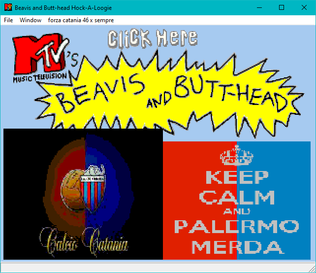

# BBLOOGIE - Sito Esaurito
**Minigioco BBLOOGIE, proveniente dal gioco del 1995 "Beavis & Butt-Head in Virtual Stupidity", modificato con i campioni audio di Sito Esaurito in dialetto siciliano orientale, nello specifico quello [catanese](https://it.wikipedia.org/wiki/Dialetto_catanese).**  
  
Per via della riproduzione randomica dei file audio nel gioco, non si escludono futuri rilasci al fine di ottimizzare l'incastro tra di essi, alcuni suoni potrebbero essere inseriti, altri esclusi.    
  
Momentaneamente non rendo pubblici i file audio e gli altri oggetti modificati nel gioco poiché devo riorganizzare il tutto, una volta completata la riorganizzazione caricherò tutto nel main di questa repository, in modo tale che possiate smanettare a vostro piacimento i file audio del gioco.  
  
Mi raccomando, inviate il file ZIP del gioco ai vostri amici, è leggero, tanto da pesare quanto un Floppy Disk ad altà densità.  
Le dimensioni dei file ZIP potrebbero variare con i futuri rilasci.	 
  
### Scaricate l'ultima versione del gioco da [qui](https://github.com/MrGasS/bbloogie-sitoesaurito/releases).  
Nella medesima pagina sono presenti anche le versioni precedenti.	 
  
  
## Seguono un video del gameplay e vari screenshot:  

https://user-images.githubusercontent.com/37547183/235440950-0f964a16-6dae-4b43-a193-8e60eee387bb.mp4

  
  
  
## NOTA BENE  
Questa applicazione e le modifiche ad essa apportate non sono state assolutamente prodotte da Sito Esaurito, tutto ciò è stato realizzato da me e solo da me medesimo nel tempo libero.  
